# GOOD

A gentle, two-device alarm for Android and Wear OS. Your phone's screen lights up first, then your watch buzzes, and only then does a sound start, quiet at first and getting louder until you dismiss it. GOOD also logs how long you slept. There is no snooze.

- Phone: OnePlus 12, OxygenOS 16 (Android 16)
- Watch: OnePlus Watch 2R, Wear OS 5
- Sleep data: OHealth, read through Health Connect

The full design is in [docs/SPEC.md](docs/SPEC.md). The review behind the latest changes is in [docs/REVIEW.md](docs/REVIEW.md).

## What it looks like

Real screenshots of the built app on emulators (Android 16 phone, Wear OS 5 round watch), not mockups. The whole app is one sports-watch instrument: MODE (or a sideways swipe) cycles ALM → SLP → PRO → CHK, and SET, ▲ and ▼ change meaning by mode. Full-size images are in [docs/screenshots](docs/screenshots).

**Phone: one instrument, four modes**

<table>
<tr>
<td>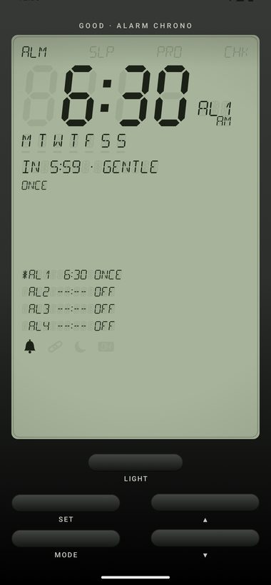</td>
<td>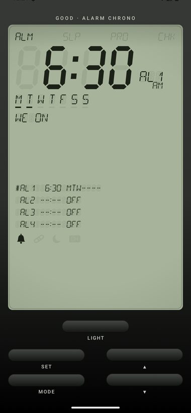</td>
<td>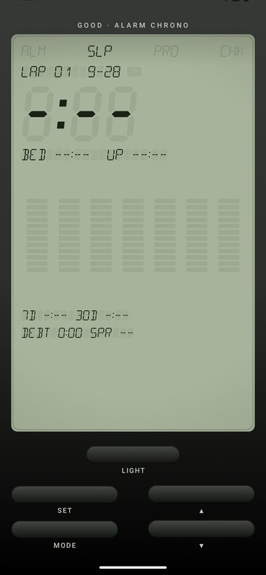</td>
<td>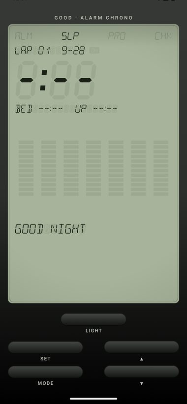</td>
</tr>
<tr>
<td><b>ALM</b>: AL1 armed, countdown and profile, all four channels</td>
<td><b>ALM · SET</b>: hour, minute, then each weekday flashes; ▲▼ toggles it</td>
<td><b>SLP</b>: last night, bed → up, 7-night graph, averages, debt</td>
<td><b>SLP · SET</b>: logs bedtime now</td>
</tr>
<tr>
<td>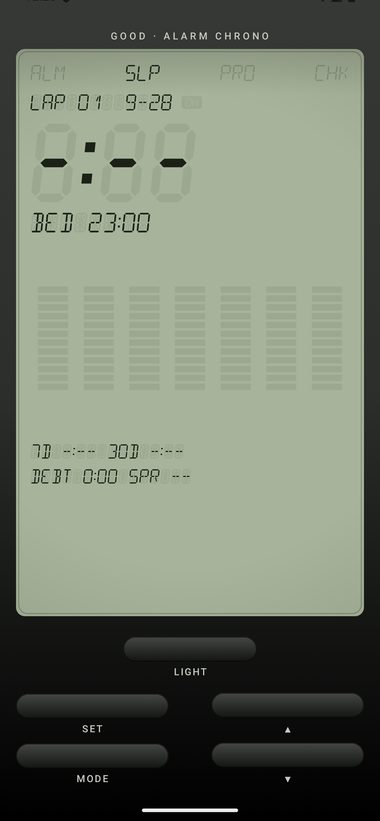</td>
<td>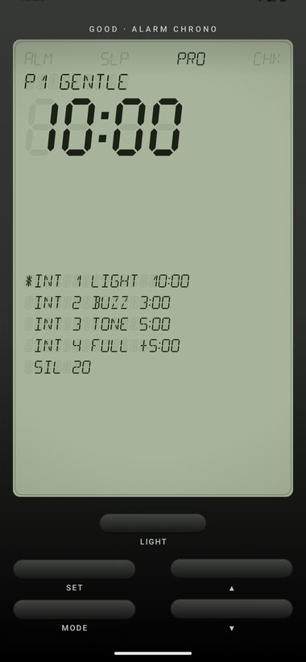</td>
<td>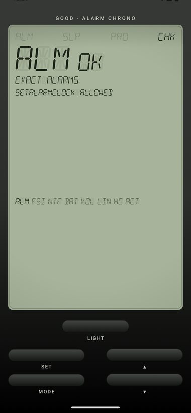</td>
<td>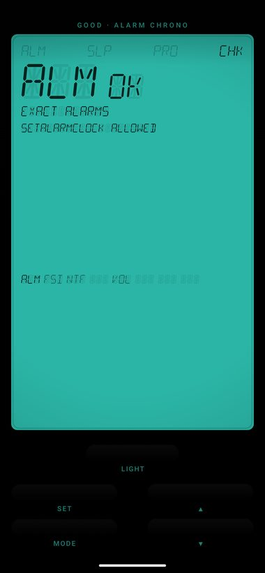</td>
</tr>
<tr>
<td><b>SLP · hold SET</b>: edit the night: BED → WAKE → GOAL → REMIND</td>
<td><b>PRO</b>: the wake profile as an interval timer; hold SET for a 60-s preview</td>
<td><b>CHK</b>: self-test strip; failing items blink</td>
<td><b>LIGHT</b>: teal glow for 3 s, no white UI at night</td>
</tr>
</table>

**Ringing: the LCD is the sunrise** (captured from the 60-second preview)

<table>
<tr>
<td>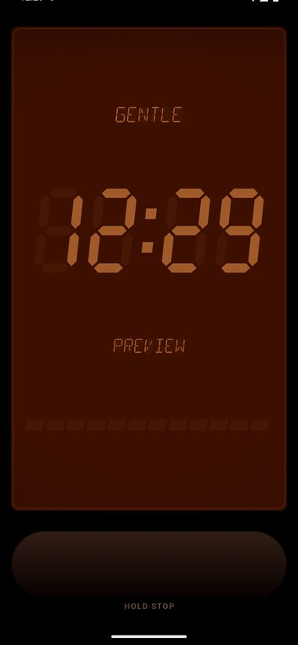</td>
<td>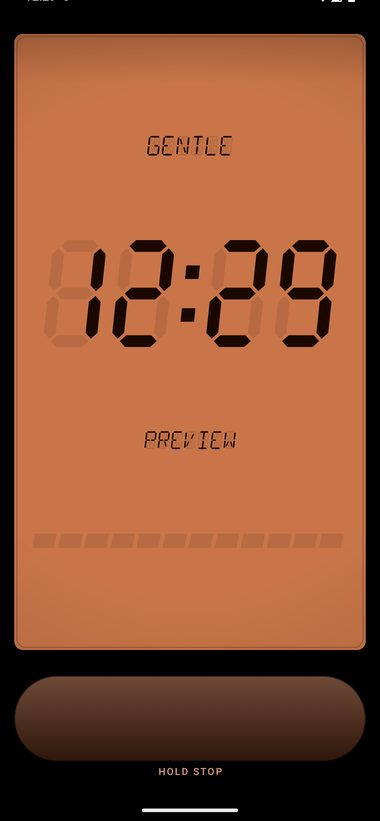</td>
<td>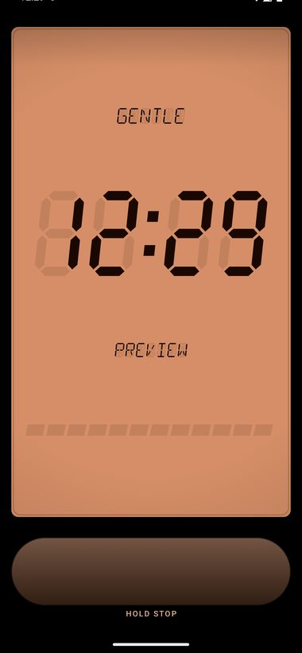</td>
<td>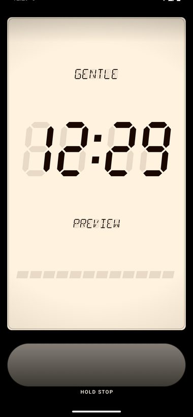</td>
</tr>
<tr>
<td><b>T−9</b>: light stage starts, deep red</td>
<td><b>T−4</b>: amber; the watch buzzes from T−3</td>
<td><b>T−3</b>: the panel keeps brightening</td>
<td><b>T</b>: warm white; sound starts at about 5% and rises. Hold STOP 2 s</td>
</tr>
</table>

**Watch: the same modes on the wrist** (OnePlus Watch 2R, 454 × 454 round)

<table>
<tr>
<td>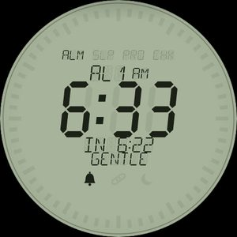</td>
<td>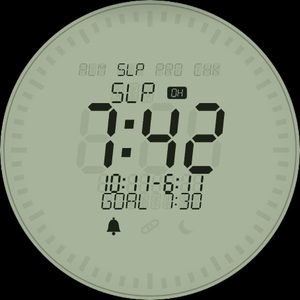</td>
<td>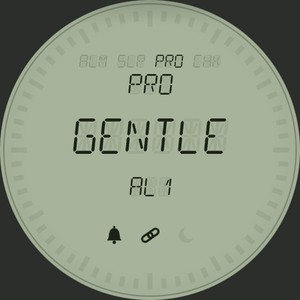</td>
<td>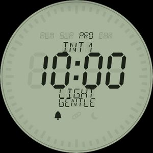</td>
</tr>
<tr>
<td><b>ALM</b>: hold to arm or disarm (sent to the phone)</td>
<td><b>SLP</b>: 7:42 from OHealth, goal 7:30; hold to log bedtime</td>
<td><b>PRO</b>: the next alarm's profile</td>
<td><b>PRO · INT 1</b>: light lead 10:00</td>
</tr>
<tr>
<td>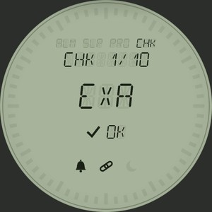</td>
<td>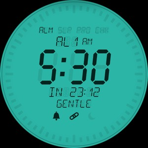</td>
<td>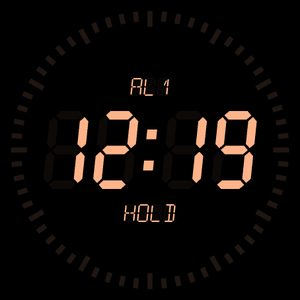</td>
<td></td>
</tr>
<tr>
<td><b>CHK</b>: EXA FSI SCR NTF BODY LINK ACT, plus BUZ and SND tests</td>
<td><b>GLOW</b>: tap the mode tabs</td>
<td><b>Ringing</b>: amber on black; hold anywhere 2 s</td>
<td></td>
</tr>
</table>

## Status: M1–M4 code complete, ready for UAT

Milestones M1–M4 are built, and both apps compile, pass lint and run on emulators. Each milestone's gate, such as 7 nights without a miss or dismiss reaching the other device within 2 s, is an on-device check that starts with UAT. M5 (burn-in) is 30 nights of real use.

| Milestone | What's in the build |
| --- | --- |
| M1 Phone alarm core | Four channels AL1–AL4 in Room. A single `rescheduleAll()` path. `setAlarmClock` at the first stage plus a backup at T. Direct-boot aware, so alarms survive a reboot while the phone is locked. Sunrise ringing screen with hold STOP 2 s. Sound ramp (CHIME or CLASSIC) and escalation. CHK self-test. |
| M2 Watch companion | Schedule sync with a merge that never re-arms an occurrence dismissed on the watch. The watch's own alarm-clock copy. Haptic ramp and speaker ramp. `/health` ping with the off-body sensor. Dismiss sent both ways as a message plus a state item, with an outbox for when the phone is out of range. |
| M3 Sleep | Health Connect read/write (OHealth first). Play services Sleep API. Watch passive asleep state, where supported. Bed button on phone, watch and tile. Session builder. SLP mode with 7-night graph, 7/30-day averages, debt and bedtime spread. Hand edit. |
| M4 Polish | Tile (`AL1 6:30 · SLP 7:42 · BED`). Next-alarm and last-night complications. PRO profile editor. Bedtime reminder. 60-s preview. JSON export. |

## Using it

The app is one LCD instrument with five buttons. MODE cycles **ALM → SLP → PRO → CHK** (or swipe sideways on the LCD). LIGHT turns on the teal glow.

| Mode | ▲ / ▼ | SET (tap) | SET (hold 2 s) |
| --- | --- | --- | --- |
| ALM | Switch channel AL1–AL4 | Edit: hour → minute → Mon…Sun → profile → tone → sound target → saves and arms | Arm / disarm (while editing: save) |
| SLP | Recall previous nights (LAP) | Log bedtime now | Edit the shown night: BED → WAKE → GOAL → REMIND |
| PRO | Step rows | Edit the flashing row (on the first row, pick the profile) | 60-second preview on the phone |
| CHK | Step items | Open the fix; on TST, a real test alarm at +3 min on both devices; on EXP, export JSON | Run the checks again |

While a field flashes, MODE leaves set mode without saving. To dismiss a ringing alarm, **hold STOP for 2 s** on the phone, or **hold anywhere for 2 s** on the watch.

Watch: tap the top or bottom half for ▲ / ▼, swipe sideways for MODE, hold 2 s for SET, and tap the mode tabs for glow.

## Build and install (Android Studio)

1. Open the `GOOD` folder and let Gradle sync, then run `app-phone` on the phone.
2. **Watch:** on the 2R, open Settings → System → About → Versions and tap the build number seven times. Turn on **ADB debugging** and **Wireless debugging**, then pair and connect:
   ```
   adb pair <watch-ip>:<pair-port>     # enter the code shown on the watch
   adb connect <watch-ip>:<port>
   ```
   Then run `app-wear` on the watch.
3. **One-time watch grants (required).** `<watch>` is the watch's serial from `adb devices` (its `ip:port`, or the `adb-…._adb-tls-connect._tcp` name once paired):
   ```
   adb -s <watch> shell appops set com.trepidity.good SYSTEM_ALERT_WINDOW allow
   adb -s <watch> shell dumpsys deviceidle whitelist +com.trepidity.good
   adb -s <watch> shell cmd appops set com.trepidity.good RUN_ANY_IN_BACKGROUND allow
   adb -s <watch> shell am set-standby-bucket com.trepidity.good active
   ```
   The 2R's system force-stops idle apps, which erases their alarms (REVIEW F1). GOOD defends itself with a silent "armed" notification on the watch whenever an alarm is pending. That is what actually keeps it alive; these grants add margin. Watch CHK → **PWR** shows the allowlist. **Don't swipe away the GOOD notification**, and after reinstalling GOOD on the watch, open it once.
   Wear OS doesn't show an alarm's full-screen notification, and it blocks background activity launches. This grant lets the watch open its hold-to-stop screen (REVIEW E1). Without it the watch still buzzes and plays sound, but you'd have to tap the notification to get the stop screen. Watch CHK → **SCR** shows whether the grant is in place.
4. Both apps must share the application ID `com.trepidity.good` and the signing key, or they won't see each other over the Data Layer. Debug builds from the same machine already share a key.
5. On the phone, open GOOD, allow notifications, and go through **CHK** until everything shows OK. On OxygenOS also set **Settings → Apps → GOOD → Battery usage → Unrestricted**. On CHK → HC, grant sleep access, including background reads if offered.

## UAT checklist

| # | Check | Pass |
| --- | --- | --- |
| 1 | CHK on the phone: ALM FSI NTF BAT VOL LINK HC USE ACT | All OK (LINK needs the watch nearby) |
| 2 | CHK on the watch: EXA FSI **SCR** NTF BODY LINK ACT | All OK |
| 3 | CHK → TST with the phone locked and the screen off | Phone light ramp, then watch buzz, then sound on the watch at +3 min |
| 4 | Dismiss the test on the watch (hold 2 s) | Phone stops within 2 s |
| 5 | TST again, dismiss on the phone (hold STOP 2 s) | Watch stops within 2 s |
| 6 | TST, then turn the phone's Bluetooth off | Watch still runs its stages |
| 7 | TST, then take the watch off before it fires | Phone buzzes and plays the sound itself |
| 8 | PRO → hold SET | 60-s sunrise preview on the phone |
| 9 | Set AL1 for a few minutes ahead, reboot the phone, **don't unlock** | Alarm still fires (direct boot) |
| 10 | Every button press registers | No missed taps (the emulator dropped a few, see below) |
| 11 | Next morning: SLP | A session for last night; OH badge once OHealth has synced |
| 12 | Watch tile and complications | `AL1 6:30`, `SLP 7:42`; BED logs a bedtime |
| 13 | ALM → hold ▼ on a weekday channel | `SKIP <day>`; watch ALM shows the following day |
| 14 | Hold ▼ again | Skip cleared on both devices |
| 15 | Set AL1 for +15 min, SLP → GOOD NIGHT, then GOOD MORNING before it rings | No ring on either device; SLP shows the wake time as the press time and `UP EARLY` |
| 16 | As 15, but press UP on the watch with the phone's Bluetooth off | Watch doesn't buzz; after reconnecting, the phone's alarm is closed (if not yet rung) |
| 17 | Skip tomorrow's alarm; next day, don't open the app until after 11:00 | Session present with the OH badge (if OHealth synced), or ending at your first unlock after the alarm time |
| 18 | Set AL1 for +11 min (Gentle). Once the phone's sunrise starts, ALM → hold SET to disarm AL1 | Sunrise stops at once; the watch doesn't buzz at T−3 |
| 19 | Next morning after a normal dismiss: SLP | `WOKE <stage> +<min>` under BED/UP |
| 20 | Install this build over the previous one (don't uninstall) | Alarms, history and sleep nights are all still there |
| 21 | Skip tomorrow on AL1, disarm AL1, re-arm it | Countdown points at tomorrow again, and it rings |

Known limits from the emulator run:
- Install the phone and watch apps together: an older app can't read the new CANCELLED state.
- Taps sometimes landed during the emulator's roughly 1-second software-rendered frames right after launch. This needs checking on the OnePlus 12 (check 10).
- The emulators weren't paired, so nothing that crosses the Data Layer has been observed yet (checks 3–7).

## Layout

```
app-phone/   LCD instrument (ui/), RingActivity + WakeService (wake/), Room (data/), scheduling (alarm/),
             sleep engine I/O (sleep/), Data Layer (sync/)
app-wear/    Round LCD app (ui/), WatchRingActivity + WakeStageService (wake/), own schedule copy (alarm/),
             outbox + listener (sync/), passive sleep (sleep/), tile + complications (surface/)
core/model/  Alarm, WakeProfile, Stage, AlarmInstance, ScheduleSnapshot, Data Layer messages
core/wake/   WakePlanner, NextOccurrence, ScheduleBuilder (roll-forward), ProfileRow (PRO editor), state machine
core/sync/   Data Layer paths, codec, ScheduleMerge
core/sleep/  Night window, session builder (source priority), metrics, bedtime reminder
core/ring/   ToneRamp (CHIME/CLASSIC, rising gain) and HapticRamp
core/lcd/    Seven- and 14-segment drawing, LCD panel, case buttons, glyphs
```

## Tests

```
./gradlew :core:wake:test :core:sync:test :core:sleep:test :core:lcd:testDebugUnitTest
```

Each test names the gate or review finding it protects. The tests cover schedule roll-forward, the wake-lock length, the watch merge, stage planning, DST and repeat days, profile editing limits, sleep source priority, onset and awakening thresholds, and the night window and metrics. Skip and I'M UP added tests for skip and cancel decisions, the current-occurrence rule, I'M UP targets, the BED/UP toggle, inferred wake and wake behaviour.
