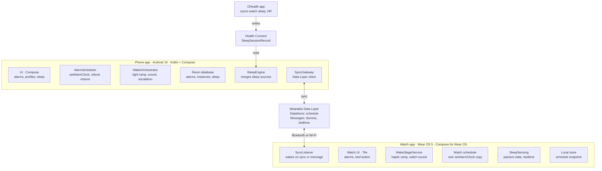
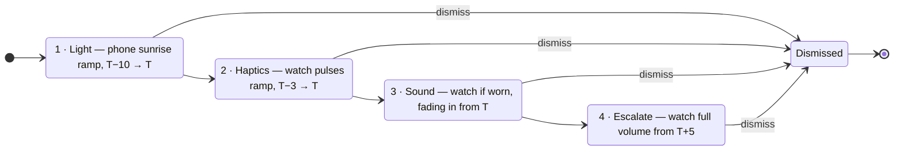

# GOOD Alarm — Design & Build Spec

As of 2026-09-27 · Jared · Living copy: the Claude doc "GOOD Alarm — Design & Build Spec"

## Overview & goals

GOOD is a native Android alarm app with a Wear OS companion that wakes you in three stages — phone light, then watch vibration, then sound — and records how long you slept. It is built for one user (a personal Android phone plus a OnePlus Watch 2R on Wear OS 5), sideloaded or published privately, with all data kept on-device.

**Success criteria for v1**

- The alarm fires on time, every time: 0 missed alarms across a 30-night test run, including with the phone in Doze, on battery saver, after a reboot, and with the watch disconnected.
- The wake-up escalates in order: light → watch haptics → sound, with each stage's start delay and duration configurable.
- Every night produces a sleep session (bedtime, wake time, total sleep) visible on the phone, without manual entry.
- Dismiss from either device stops both devices within 2 seconds when they are connected.

## Requirements

V1 covers alarms, the staged wake-up and automatic sleep logging; smart-window waking and sleep staging come after.

| ID | Requirement | Priority |
| --- | --- | --- |
| F1 | Create, edit, delete and toggle alarms: time, repeat days, label, per-alarm wake profile | Must |
| F2 | Staged wake-up: phone light ramp → watch vibration ramp → audible sound on phone and/or watch | Must |
| F3 | Configurable stage offsets and durations per profile (e.g. light at T−10 min, haptics at T−3 min, sound at T) | Must |
| F4 | Dismiss from phone or watch, synced to the other device. No snooze, ever | Must |
| F5 | Watch fires its own stages even when Bluetooth is disconnected | Must |
| F6 | Record a sleep session per night: bedtime, wake time, total duration, awake interruptions | Must |
| F7 | Sleep history: 7-day and 30-day views, average duration, bedtime consistency | Must |
| F8 | Write sleep sessions to Health Connect so other apps can read them | Should |
| F9 | Bedtime reminder based on a sleep goal (e.g. 7.5 h) and the next alarm | Should |
| F10 | Watch tile and complication showing next alarm and last night's sleep | Should |
| F11 | Smart wake window: fire within the last 20 min before the alarm when light sleep is detected | Later |
| F12 | Sleep stages (light/deep/REM) from watch heart-rate data | Later |

**Non-functional**

- Reliability: alarms scheduled with the OS alarm-clock API, restored after reboot, time-zone change and app update.
- Privacy: no network permission in v1; data stays in the on-device database, excluded from cloud backup unless you opt in.
- Battery: under 3% overnight drain on the watch and under 2% on the phone from GOOD itself.
- Accessibility: large touch targets on the watch; dismiss works half-asleep without precise taps (full-width swipe or a long press on the crown button).
- Out of scope for v1: iOS, other watch brands, cloud sync, sharing.

## Platform constraints

On Android 14+ an alarm fires reliably only through `AlarmManager.setAlarmClock()`, backed by the exact-alarm and full-screen-intent permissions that alarm-clock apps are allowed to hold. The watch is the harder side: weak haptics, a dual-chip design, and sleep data that lives in OHealth.

| Area | Constraint | Design response |
| --- | --- | --- |
| Exact alarms | `SCHEDULE_EXACT_ALARM` is denied by default for new installs on Android 14+; `setAlarmClock()` needs it or `USE_EXACT_ALARM`, which alarm-clock apps may declare and get auto-granted ([source](https://developer.android.com/about/versions/14/changes/schedule-exact-alarms)) | Declare `USE_EXACT_ALARM` on phone and watch; still check `canScheduleExactAlarms()` on resume |
| Ringing service | The `systemExempted` foreground-service type is allowed for apps holding `SCHEDULE_EXACT_ALARM` or `USE_EXACT_ALARM`; needs `FOREGROUND_SERVICE_SYSTEM_EXEMPTED` ([source](https://developer.android.com/develop/background-work/services/fgs/service-types)) | Run each wake stage in a `systemExempted` foreground service |
| Lock screen | Android 14 limits `USE_FULL_SCREEN_INTENT` to calling and alarm apps | Check `canUseFullScreenIntent()` at launch; deep-link to the settings page if revoked |
| Target SDK | From Aug 31, 2026, Play requires phone apps to target API 36 and Wear OS apps API 35 ([source](https://developer.android.com/google/play/requirements/target-sdk)) | Phone targetSdk 36, watch targetSdk 35, even if sideloaded |
| Watch OS | Wear OS 5 is based on Android 14; the 2R pairs a Snapdragon W5 Gen 1 with a BES2700 MCU ([specs](https://www.oneplus.com/global/oneplus-watch-2r/specs)) | Watch minSdk 33; keep watch work to short wakes — GOOD runs on the W5, which costs battery |
| Watch hardware | Built-in speaker (used for calls); haptics described as weak; accelerometer, gyroscope, optical HR, SpO2, light sensor; 500 mAh ([review](https://www.smartprix.com/bytes/oneplus-watch-2r-review-an-interesting-wear-os-watch/)) | Watch plays the sound stage by default; haptic patterns use long, full-amplitude pulses |
| Sleep data | OHealth uploads steps, heart rate and sleep to Health Connect ([Sahha](https://sahha.ai/integrations/ohealth/)); Health Connect is built into Android 14 and its `SleepSessionRecord` carries stages ([source](https://developer.android.com/health-and-fitness/health-connect/data-types)) | Health Connect is the primary sleep source |
| Watch sensing | Health Services passive monitoring can report `USER_ACTIVITY_ASLEEP` where the device supports it ([source](https://developer.android.com/training/wearables/health-services/passive)) | Check capabilities on the 2R in the first spike; use only if supported |
| Phone sensing | The Play services Sleep API gives periodic sleep-confidence events and a daily sleep segment ([source](https://developers.google.com/location-context/sleep)); its codelab is marked deprecated | Fallback source only |

## Architecture

GOOD is two native Kotlin apps sharing `:core` libraries: the phone owns the alarm schedule and sleep history, and the watch keeps its own copy of the schedule so its stages fire without the phone.

The phone is the source of truth; every edit pushes a new schedule snapshot to the watch, and a dismiss on either device is sent as a message and also written as state so a device that was out of range catches up.

| Data Layer path | Type | Direction | Payload |
| --- | --- | --- | --- |
| `/schedule` | DataItem | phone → watch | All enabled alarms with next fire time and wake profile, plus a version number |
| `/instance/{id}/state` | DataItem | both ways | Current state of a firing alarm (ringing, dismissed, silenced) with a timestamp |
| `/cmd/dismiss` | Message | both ways | Instance id; the receiver stops its stages within 2 s |
| `/sleep/bedtime` | Message | watch → phone | Time the bed button was pressed |
| `/health` | Message | phone → watch | Ping before each alarm to confirm the watch is reachable and worn |

## Gentle wake-up sequence

Each alarm runs a wake profile of four timed stages relative to the alarm time T; both devices compute the same stage times from T, so neither waits on the other to start.

There is no snooze: dismiss from any stage ends the alarm everywhere within 2 s and stamps the wake time on the sleep session; auto-silence at T+20 is the only other exit.

**Default profile ("Gentle")** — every value is editable per profile.

| Stage | Device | Starts | Ramp | Implementation |
| --- | --- | --- | --- | --- |
| 1 Light | Phone | T−10 min | Brightness 1% → 100% over 10 min, warm red → amber → white | Full-screen `RingActivity` with `setShowWhenLocked` and `setTurnScreenOn`; animate `WindowManager.LayoutParams.screenBrightness`; optional torch at low strength (`turnOnTorchWithStrengthLevel`) |
| 2 Haptics | Watch | T−3 min | One 400 ms pulse every 20 s, rising to 3 × 800 ms every 5 s | `VibrationEffect.createWaveform` at full amplitude; the 2R's motor is weak, so length does the work rather than amplitude |
| 3 Sound | Watch when worn and reachable (default), otherwise phone. Also selectable: phone, watch, or both | T | Starts soft (about 5%) and keeps rising every 10 s until dismissed; full volume by T+5 min | `AudioTrack`/`MediaPlayer` on `USAGE_ALARM` so Do Not Disturb lets it through; on the watch, route to the built-in speaker and step the player volume; M0 checks how quiet the 2R's speaker can go |
| 4 Escalate | Both | T+5 min | Watch at 100% with continuous haptics; phone sound joins at T+10 min as a safety net | Same services, max settings |
| Auto-silence | Both | T+20 min | — | Stop, log as unanswered, post a notification |

**Fallbacks**

- **Watch unreachable or off-wrist.** The phone pings `/health` at T−15 min; the watch answers with its off-body sensor state. No answer or off-wrist → the phone vibrates in stage 2 and plays the sound in stage 3.
- **Watch never got the latest schedule.** The watch fires from its last snapshot; the schedule `version` lets the phone detect and log the mismatch.
- **Phone in use at T−10.** The system shows a heads-up notification instead of the full screen; GOOD skips the light ramp because the screen is already on.
- **Phone rebooted overnight.** A `BOOT_COMPLETED` receiver re-registers alarms; a stage whose window already passed is skipped, not replayed.
- **Snooze.** None, by design. No screen, notification or button on either device offers one.

## Sleep tracking

GOOD records one sleep session per night by merging up to four sources, preferring the watch's own tracker (OHealth, read through Health Connect) and falling back to GOOD's own signals.

| Priority | Source | Gives | Available |
| --- | --- | --- | --- |
| 1 | Health Connect sessions written by OHealth | Start, end, and stages if OHealth includes them | After OHealth syncs, usually within an hour of waking |
| 2 | Watch passive state (Health Services `USER_ACTIVITY_ASLEEP`) | Asleep and awake transitions | Only if the 2R reports the capability — verified in milestone M0 |
| 3 | Phone Sleep API (Play services) | Sleep confidence every few minutes, a daily sleep segment | Always, if `ACTIVITY_RECOGNITION` is granted |
| 4 | Anchors | Bed-button press on watch or phone; alarm dismiss time | Always |

**How a session is built**

1. Each night window runs 18:00 to 14:00 the next day and belongs to the wake date.
2. On dismiss, GOOD writes a provisional session: start = bed-button time (or first asleep signal), end = dismiss time.
3. A WorkManager job runs at dismiss +30 min, +2 h and at 11:00. It reads Health Connect sleep sessions overlapping the window; one from another app replaces the provisional values and is tagged with its source.
4. With no Health Connect session, GOOD derives one from sources 2–3: sleep onset = start of the first 20-min asleep run; wake = last asleep sample before dismiss; an awakening = an awake run of 5 min or more.
5. Only sessions GOOD built itself are written back to Health Connect, so OHealth's data is never duplicated.
6. You can edit start and end by hand; edited sessions are marked and never overwritten by later syncs.

**Metrics shown**

- Time in bed and total sleep, per night and as 7- and 30-day averages
- Sleep onset latency (bed button → asleep) and number of awakenings
- Sleep debt against your goal over the last 7 nights
- Bedtime consistency: spread of bedtimes over 14 nights, in minutes
- Wake behaviour: stage at which you dismissed, minutes from first stage to dismiss

Sleep stages are displayed only when OHealth provides them; GOOD does not compute its own stages in v1 (F12).

## UX design

The phone is where you set things up and review sleep; the watch is where you go to bed and wake up, so its screens favour one-gesture actions over menus.

**Phone screens**

| Screen | Contents | Key actions |
| --- | --- | --- |
| Alarms (home) | Next-alarm card ("in 7 h 20 m", suggested bedtime for your sleep goal), alarm list with toggles, watch status chip (connected, battery, last sync) | Add alarm, toggle, open editor |
| Alarm editor | Time, repeat days, label, wake profile, sound device (Auto: watch when worn, else phone; phone; watch; both) | Save; "Preview" runs the whole profile compressed into 60 s |
| Wake profiles | Presets: Gentle (default), Quick (T−3 / T−1 / T), Heavy sleeper (escalate at T+2); editor shows the stages on a time line with draggable start points | Duplicate, edit, set default |
| Ringing | Full-screen gradient that tracks the light ramp, large time; buttons fade in at stage 3 | Full-width slide to dismiss (the only control) |
| Sleep | Last night card (total sleep, bed → wake, source badge), 7- and 30-day bars against the goal line, consistency figure | Open a night, edit its times |
| Settings | Sleep goal, bedtime reminder, default profile, Reliability check (each permission and battery setting with status and a Fix button), test alarm | Fix permissions, run test |

**Watch surfaces**

| Surface | Contents | Key actions |
| --- | --- | --- |
| Tile | Next alarm and countdown, last night's total sleep | "Bed" button logs bedtime |
| Complications | Next alarm (short text); last night's sleep against goal (ranged value) | Tap opens app |
| App | Alarm list with toggles; toggles are sent to the phone, which applies them and republishes the schedule | Toggle, skip next occurrence |
| Ringing, stage 2 | Dim, black screen with time only, so it doesn't light the room | Swipe to dismiss |
| Ringing, stage 3+ | Time and a full-width "swipe to dismiss" track | Swipe to dismiss; the system swipe-to-close is disabled on this screen |

**Design rules**

- Dark theme everywhere; the ringing screens never show white until the light ramp reaches it.
- Every destructive or overnight-critical setting (disable alarm, change profile) shows the next fire time after saving.
- There is no snooze. Dismiss requires a deliberate swipe, so a half-asleep tap never ends the alarm by accident.

## Data model & storage

The phone keeps everything in one Room database; the watch keeps only a snapshot of the schedule plus a small queue of events to send.

| Entity | Key fields | Notes |
| --- | --- | --- |
| `Alarm` | id, hour, minute, repeatDays (bitmask), label, enabled, profileId, soundTarget (AUTO / PHONE / WATCH / BOTH; AUTO = watch when worn and reachable, else phone), skipNextDate | Source of truth for the schedule |
| `WakeProfile` | id, name, stages (JSON list of `Stage`), autoSilenceMinutes (no snooze fields) | Presets seeded on first launch |
| `Stage` | type (LIGHT / HAPTIC / SOUND / ESCALATE), device, offsetSec (relative to T), rampSec, params | Embedded in `WakeProfile` |
| `AlarmInstance` | id, alarmId, scheduledAt (UTC), state (SCHEDULED / FIRING / DISMISSED / SILENCED / SKIPPED), currentStage, dismissedAt, dismissedOn (PHONE / WATCH) | One row per occurrence; drives the state machine and the wake metrics |
| `SleepSession` | id, wakeDate, start, end, source (HEALTH_CONNECT / WATCH / PHONE / ANCHORS), sourcePackage, edited, healthConnectId | One per night |
| `SleepSegment` | sessionId, start, end, kind (ASLEEP / AWAKE / LIGHT / DEEP / REM) | Stages only when the source provides them |
| `SleepSignal` | timestamp, source, confidence, motion, light | Raw phone and watch samples; pruned after 14 days |
| `EventLog` | timestamp, device, type, detail | Diagnostics; pruned after 30 days |

**Rules**

- All times stored as UTC instants; alarm times as local wall-clock hour and minute, recomputed on time-zone change and daylight-saving shifts.
- The `/schedule` DataItem is a serialized list of the next `AlarmInstance` per enabled alarm, with its `WakeProfile` inlined and a monotonically increasing `version`.
- The database is excluded from Android auto-backup by default (`dataExtractionRules`); an opt-in export writes a JSON file you choose.

## Permissions, reliability & battery

| Permission | Device | Why | How granted |
| --- | --- | --- | --- |
| `USE_EXACT_ALARM` | Both | `setAlarmClock()` for stage start times | Install time (alarm-clock apps) |
| `FOREGROUND_SERVICE`, `FOREGROUND_SERVICE_SYSTEM_EXEMPTED` | Both | Run the wake stages as a foreground service | Install time |
| `USE_FULL_SCREEN_INTENT` | Both | Ringing screen over the lock screen | Default for alarm apps; verified at launch |
| `POST_NOTIFICATIONS` | Both | Alarm, bedtime and unanswered-alarm notifications | Runtime prompt |
| `RECEIVE_BOOT_COMPLETED`, `WAKE_LOCK`, `VIBRATE` | Both | Reschedule after reboot; keep CPU awake during stages; haptics | Install time |
| `ACTIVITY_RECOGNITION` | Both | Phone Sleep API; watch passive asleep state | Runtime prompt |
| `health.READ_SLEEP`, `health.WRITE_SLEEP` | Phone | Read OHealth sessions, write GOOD's own | Health Connect consent screen |
| `health.READ_HEALTH_DATA_HISTORY` | Phone | One-time import of sleep older than 30 days | Health Connect consent screen (optional) |

**Reliability rules**

1. Phone: one `setAlarmClock()` at the first stage (T−10) plus a backup at T. The status bar therefore shows the first-stage time; that trade-off is accepted because `setAlarmClock()` is the only call exempt from Doze without rate limits.
2. Watch: `setAlarmClock()` at its first stage (T−3) plus a backup at T, from its own snapshot.
3. The stage timeline runs inside the foreground service with a partial wake lock, released on dismiss, silence or a 25-min hard cap.
4. Every scheduling path (boot, app update, time change, time-zone change, schedule sync) goes through one idempotent `rescheduleAll()`.
5. The Reliability check screen reads `canScheduleExactAlarms()`, `canUseFullScreenIntent()`, `isIgnoringBatteryOptimizations()` and `isBackgroundRestricted()`, and links to the fix for each.

**Battery budget (overnight, GOOD only):** watch under 3% (no continuous sensor listeners; wakes limited to syncs, the T−15 ping and the stage service ≤ 25 min); phone under 2%.

## Build plan

Single Gradle project in Kotlin with two app modules that share one package name and signing key — the Wearable Data Layer only connects apps that match on both.

| Concern | Choice |
| --- | --- |
| Language and build | Kotlin 2.x, Gradle version catalog; phone minSdk 34 / targetSdk 36 (OnePlus 12 on OxygenOS 16, Android 16), watch minSdk 33 / targetSdk 35 |
| Phone UI | Jetpack Compose, Material 3, Navigation Compose |
| Watch UI | Compose for Wear OS, Horologist, Tiles (ProtoLayout), complication data source |
| State and DI | Coroutines and Flow, Hilt |
| Storage | Room (phone), DataStore (both), kotlinx.serialization for Data Layer payloads |
| Scheduling | `AlarmManager.setAlarmClock()`; WorkManager only for sleep sync jobs |
| Sync | `play-services-wearable`: DataClient, MessageClient, NodeClient |
| Health | `androidx.health.connect:connect-client` (phone), `androidx.health:health-services-client` (watch), `play-services-location` Sleep API (phone) |
| Testing | JUnit, Turbine, Robolectric, Compose UI tests |

**Milestones** (part-time pace)

| Milestone | Weeks | Scope | Gate |
| --- | --- | --- | --- |
| M0 Spike | 1 | Prove the watch can ring, buzz and play sound; check Health Connect receives OHealth sleep | Go/no-go: watch rings with Bluetooth off; pick v1 sleep sources |
| M1 Phone alarm core | 2–3 | Alarms, scheduler, ring service, light ramp, sound, Reliability check | 7 nights phone-only, zero misses (incl. forced Doze and a reboot) |
| M2 Watch companion | 4–5 | Data Layer sync, watch scheduler, haptics, dismiss sync, fallbacks | Dismiss reaches the other device in 2 s; watch fires with phone out of range |
| M3 Sleep tracking | 6–7 | Health Connect read/write, Sleep API, bed button, session builder, Sleep screen | A session appears for 7 of 7 nights |
| M4 Polish | 8 | Tile, complications, profile editor, bedtime reminder, 60 s preview | All Must and Should requirements demoed |
| M5 Burn-in | 9–12 | 30 nights of daily use, EventLog reviewed weekly | v1.0: zero missed alarms in 30 nights |

## Testing plan

The stage engine and sleep-session builder are pure Kotlin and tested with a fake clock; everything that touches the OS is tested on the real phone and the 2R.

| Scenario | How | Pass |
| --- | --- | --- |
| Deep Doze | `adb shell dumpsys deviceidle force-idle` on each device, alarm 5 min out | Every stage starts within 5 s of plan |
| Reboot overnight | Reboot phone and watch at T−30 | Alarm fires on both |
| App update | `adb install -r` with an alarm pending | Alarm still fires |
| Phone out of range | Phone Bluetooth off at T−20 | Watch runs its stages from its snapshot |
| Watch off-wrist | Remove watch before T−15 | Phone vibrates in stage 2 and sounds in stage 3 |
| Cross-device dismiss | Dismiss on watch, then on phone, on separate nights | Other device stops within 2 s |
| Do Not Disturb and battery saver | Both on, on both devices | Light, haptics and sound all run |
| Time-zone change | Change zone with an alarm set | Next fire time follows local wall-clock time |
| Sleep session | Normal night with OHealth tracking | Session shown by 11:00 with the OHealth source badge |

## Risks & decisions

| Risk | Impact | Mitigation |
| --- | --- | --- |
| The 2R's dual-chip power management delays or blocks third-party alarms and full-screen screens on the watch | Stage 2 fails silently | M0 spike; phone always vibrates as backup when the watch misses its `/health` ping |
| Watch haptics too weak to wake you | Stage 2 ineffective | Longer, denser patterns; option to start watch sound at low volume in stage 2 |
| Watch speaker can't play quietly enough for a gentle start | Sound stage not gentle | M0 measures the lowest usable gain; fall back to phone sound for the first minute |
| OHealth writes sleep late, only as a duration, or not at all | Sleep history gaps | Sources 2–4 build the session; Health Connect data replaces it when it arrives |
| Play services Sleep API is retired | Phone-side fallback lost | Anchors plus watch passive state still produce a session |
| Health Services doesn't report `USER_ACTIVITY_ASLEEP` on the 2R | No watch-side sleep signal; smart wake (F11) not possible | Rely on Health Connect and anchors; revisit F11 |
| OxygenOS battery management on the OnePlus 12 stops the ring service | Missed alarm | `setAlarmClock()` plus backup alarm; battery use set to Unrestricted; Reliability check flags restrictions |

**Decisions**

- **Phone:** OnePlus 12 on OxygenOS 16 (Android 16), so the phone app uses minSdk 34.
- **Distribution:** installed from Android Studio onto both devices; no Play listing for now.
- **Sleep source:** keep the OHealth integration (via Health Connect) as the primary sleep source. Replacing it with GOOD's own tracking, which smart wake (F11) and sleep stages (F12) would need, is a possible future phase, not v1.
- **Snooze:** none, ever. An alarm ends only by dismiss or auto-silence.

## Sources

- [Android 14 exact-alarm changes](https://developer.android.com/about/versions/14/changes/schedule-exact-alarms)
- [Foreground service types](https://developer.android.com/develop/background-work/services/fgs/service-types)
- [Google Play target API level requirements](https://developer.android.com/google/play/requirements/target-sdk)
- [Health Connect data types](https://developer.android.com/health-and-fitness/health-connect/data-types)
- [Health Services passive monitoring](https://developer.android.com/training/wearables/health-services/passive)
- [Sleep API](https://developers.google.com/location-context/sleep)
- [OnePlus Watch 2R specs](https://www.oneplus.com/global/oneplus-watch-2r/specs)
- [OnePlus Watch 2R review, Smartprix](https://www.smartprix.com/bytes/oneplus-watch-2r-review-an-interesting-wear-os-watch/)
- [OHealth integration, Sahha](https://sahha.ai/integrations/ohealth/)
